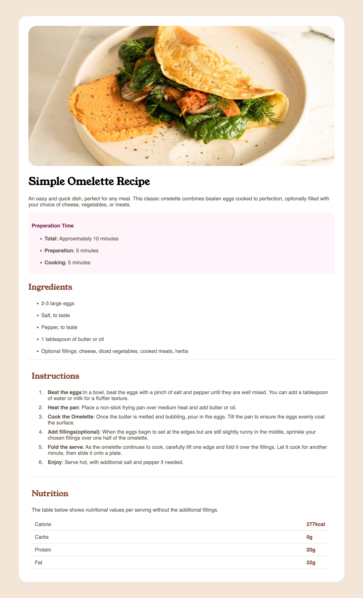

# Frontend Mentor - Recipe page solution

This is a solution to the [Recipe page challenge on Frontend Mentor](https://www.frontendmentor.io/challenges/recipe-page-KiTsR8QQKm). Frontend Mentor challenges help you improve your coding skills by building realistic projects. 

## Table of contents

- [Overview](#overview)
  - [Screenshot](#screenshot)
  - [Links](#links)
- [My process](#my-process)
  - [Built with](#built-with)
  - [What I learned](#what-i-learned)
  - [Continued development](#continued-development)
- [Author](#author)

## Overview

### Screenshot

### Links

- Solution URL: [Recipe Page Chalenge Repo](https://github.com/theHalfBloodStackMaster/recipe-page-chalange)
- Live Site URL: [Recipe Page Chalenge Web Page](https://thehalfbloodstackmaster.github.io/recipe-page-chalange/)

## My process

### Built with

- Semantic HTML5 markup
- CSS custom properties

### What I learned

This is my first web page creation, and i have kept it very simple by using html and css only. I have learned how to change font family, precedence of styling in css and inline html elements, creating unordered and ordered list, table creation and image handling.

### Continued development

I want to focus on mobile first approach and creat web pages using javascript using React and Next.js

## Author

- Frontend Mentor - [@theHalfBloodStackMaster](https://www.frontendmentor.io/profile/theHalfBloodStackMaster)
